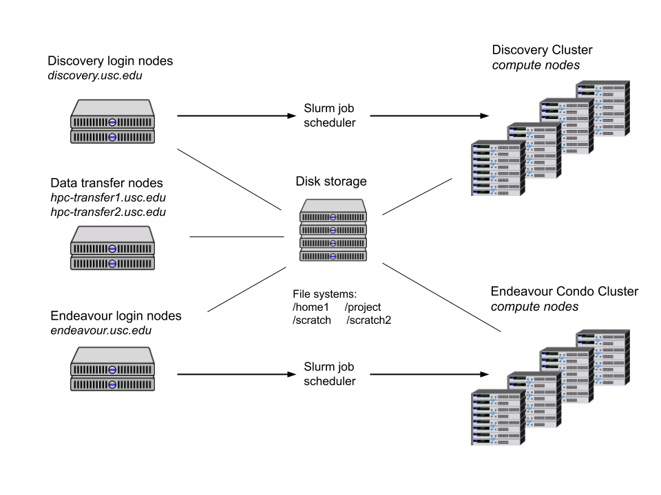

```{r setup, include=FALSE}
knitr::opts_chunk$set(echo = FALSE, results = 'asis', warning = FALSE, comment = "")
cat2 <- function(..., lang = 'r') {
  cat("```", lang, "\n", sep = "")
  cat(...)
  cat("```\n")
}
```


# Overview of HPC at USC

<div align="center">
<figure>

<figcaption>
Cyberinfrastructure overview (source: <https://carc.usc.edu/user-information/system-information>)
</figcaption>
</figure>
</div>

# Hello world

For a quick-n-dirty intro to Slurm, we will start with a simple "Hello world"
using Slurm + R. For this, we need to go through the following steps:

1.  Copy a Slurm script to HPC,

2.  Logging to HPC, and

3.  Submit the job using `sbatch`.


## Step 1: Copy the Slurm script to HPC

We need to copy the following Slurm script to HPC ([00-hello-world.slurm](00-hello-world.slurm){target="_blank"}):

```{r helloworld}
cat2(readLines("00-hello-world.slurm"), sep = "\n", lang = "bash")
```

Which has four lines:

1.  `#!/bin/sh` the **shebang** ([**shewhat?**](https://stackoverflow.com/questions/7366775/what-does-the-line-bin-sh-mean-in-a-unix-shell-script))

2.  `#SBATCH --output=00-hello-world.out` an option to be passed to `sbatch`, in
    this case, the name of the output file to which
    [**stdout and stderr**](https://en.wikipedia.org/wiki/Standard_streams) will go.
    
3.  `module load usc r` uses [**Lmod**](https://lmod.readthedocs.io/en/latest/) to load the `usc` (required) and `R`
    modules.
    
4.  `Rscript ...` a call to R to evaluate the expression `paste(...)`. This will
    get the environment variable `SLURMD_NODENAME` (which `sbatch` creates) and
    print it on a message.


To do so, we will use **Secure copy protocol (scp)**, which allows us to copy
data to and fro computers. In this case, we should do something like the following

```bash
scp 00-hello-world.slurm vegayon@hpc-transfer1.usc.edu:/home1/vegayon/
```

In words, "Using the username `vegayon`, connect to `hpc-transfer1.usc.edu`, take
the file `00-hello-world.slurm` and copy it to `/home1/vegayon/`. With the file
now available in the cluster, we can submit this job using Slurm.


## Step 2: Logging to HPC

1.  Log-in using ssh. In the case of Windows users, download the
    [**Putty**](https://www.chiark.greenend.org.uk/~sgtatham/putty/) client. You have
    two options, the
    [**discovery**](https://carc.usc.edu/user-information/user-guides/high-performance-computing/getting-started-discovery)
    or
    [**endeavour**](https://carc.usc.edu/user-information/user-guides/high-performance-computing/getting-started-endeavour)
    clusters.

2.  To login, you will need to use your USC Net ID. If your USC email is
    `flasname@usc.edu`, your USC Net ID is `flastname`. Then:
    
    ``` {.bash}
    ssh flastname@discovery.usc.edu
    ```
    
    if you want to use the discovery cluster (available to all USC members), or
    
    ``` {.bash}
    ssh flastname@endeavour.usc.edu
    ```
    
    if you want to use the endeavour cluster (using private condos).


## Step 3: Submitting the job

Overall, there are two ways to use the compute nodes: interactively (`salloc`)
and in batch mode (`sbatch`).  In this case, since we have a Slurm script, we
will use the latter.

To submit the job, we can simple type the following:

```bash
sbatch 00-hello-world.slurm
```

And that's it!

In the case of interactive sessions, You can start one using the `salloc` command.
For example, if you wanted to run R with 8 cores, using 16 Gigs of memory in
total, you would need to do the following:
    
```bash
salloc -n1 --cpus-per-task=8 --mem-per-cpu=2G --time=01:00:00
```

Once your request is submitted, you will get access to a compute node.
Within it, you can load the required modules and start R:

```bash
module load usc r
R
```

Interactive sessions are not recommended for long jobs. Instead, use this
resource if you need to inspect some large dataset, debug your code, etc.

